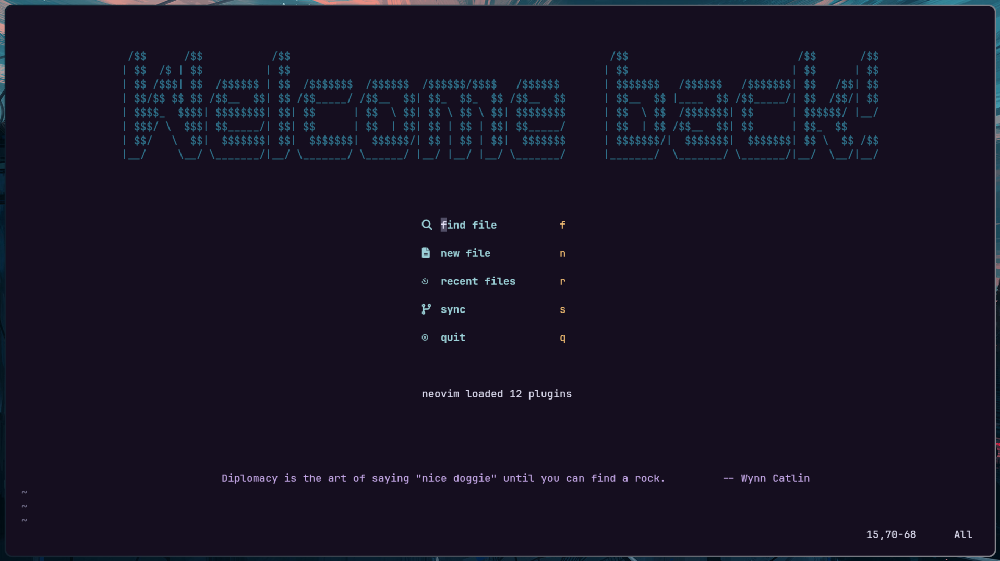
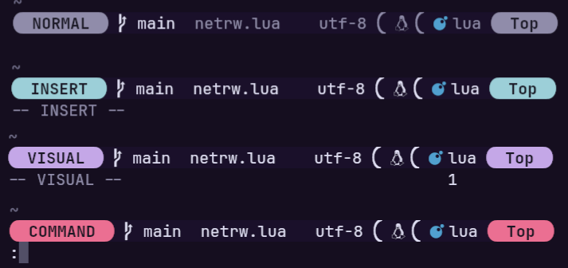
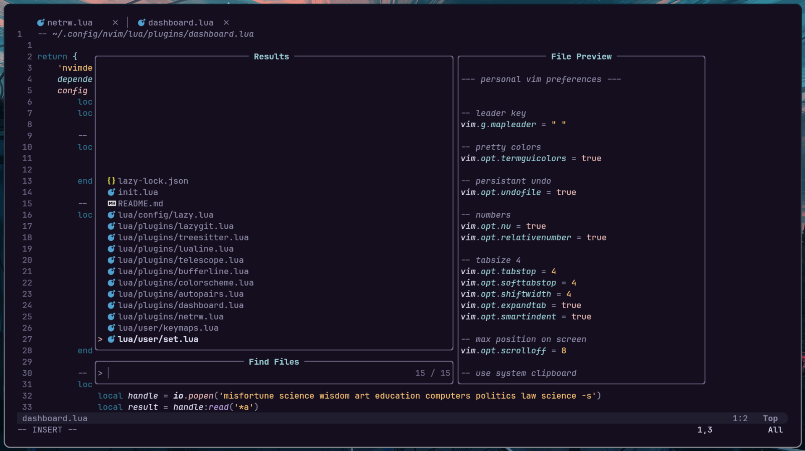

# My Neovim Setup

Welcome to my personal and opinionated neovim repository! 🎉

### Dashboard: 


### Modes:


### Telescope/Bufferline:


## What's Inside?

### File tree of the configuration

<prev>
├─ init.lua
└─ lua/
    ├── config/
    │    └── lazy.lua
    ├── plugins/
    │    └── (all plugins)
    └── user/
         ├── keymaps.lua
         └── set.lua
</prev>

### Files description

Here's a quick overview of the plugins included in this repo:

  - **`autopairs.lua`**: Autocompletes parentheses and quotes.
  - **`bufferline.lua`**: Enhances the buffer line with a tab-like interface.
  - **`colorscheme.lua`**: Sets the color scheme for a pleasant visual experience.
  - **`dashboard.lua`**: Customizes the startup dashboard with a personalized touch.
  - **`lazygit.lua`**: Integrates LazyGit for a seamless git experience.
  - **`lualine.lua`**: Configures the status line for a clean and informative display.
  - **`netrw.lua`**: Tweaks the netrw file explorer settings.
  - **`telescope.lua`**: Sets up Telescope for powerful file and text searching.
  - **`treesitter.lua`**: Configures Tree-sitter for improved syntax highlighting.

Caution! **colorscheme.lua** by default uses my terminal color. if you want to change that, go to **colorscheme.lua** and change the **transparency = true** line. (neovim will look a bit uglier, but that's your problem, not mine!)

And also, the configuration files for neovim:

  - **`keymaps.lua`**: Custom key mappings for efficient navigation.
  - **`set.lua`**: General Neovim settings and options.

## Getting Started

To get up and running with this setup:

0. **necessary packages**:
    misfortune

1. **Clone the Repository**:
   ```bash
   git clone https://github.com/gabriel-salmoria/nvim.git ~/.config/nvim

2. **Remove the unecessary files**:
   ```bash
    rm -rf preview README.md .git

3. **Install Plugins: Open Neovim and run :Lazy sync (just press 's' in the dashboard) to install all the plugins specified in the configuration.**

4. **Done!**
